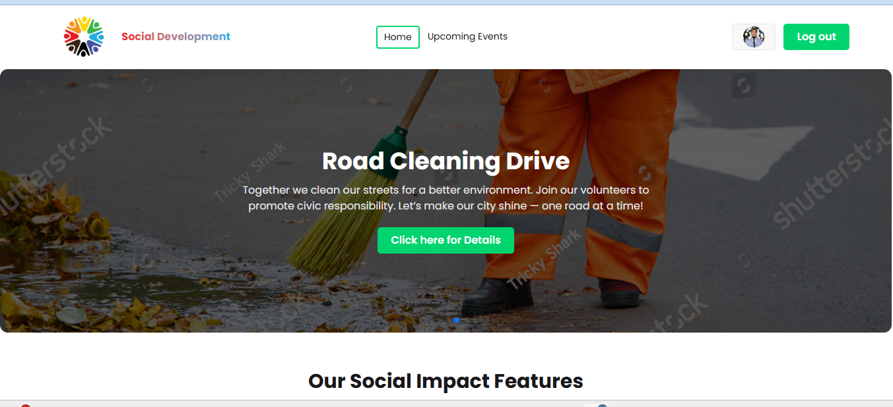

  

 ### Social Development Events Platform

Social Development Events Platform is a clean and modern social event website that helps organizers share their programs easily and reach more people.
It provides users with clear event details, such as date, time, venue, and category, in a simple interface.
The platform ensures smooth registration, secure data handling, and real-time updates for newly added events.
Overall, it offers a reliable, safe, and engaging space for users to connect with different activities.

Live Demo:
https:https://socialeventorganization.netlify.app/

🛠️ Technologies Used

React.js

Firebase

Tailwind CSS

Daisy UI

React Router

React Toastify

Netlify

Framer Motion

MongoDB

🚀 Key Features

Event Listing: Users can view all upcoming events with clean and organized details

Event Details Page: Each event shows date, time, location, and category

User Registration: Users can easily join events

Event Filtering: Events can be filtered by type

Responsive Design: Works smoothly on mobile, tablet, and desktop

Admin Dashboard: Organizers can add, update, or delete events

Image Upload: Event organizers can upload photos or banners for each event

Real-Time Updates: Newly added or updated events appear instantly

Secure Backend: User data and event information are safely stored

Search Functionality: Users can quickly find specific events by title

User-Friendly Interface: Clean, simple, and easy navigation for all users

Login & Authentication: Secure login for event creators and participants

📦 NPM Packages Used

react

react-dom

react-router

react-toastify

firebase

tailwindcss

daisyui

▶️ Getting Started

To get started with this Social Event Website, follow these steps:

Install Dependencies
Navigate to the project folder and run:

npm install

Setup Environment Variables
Create a .env file and add your database and API keys as required.

Start the Development Server
Run the following command to launch the website locally:

npm run dev

Contribute
Make changes or improvements to the code and push updates if needed.
